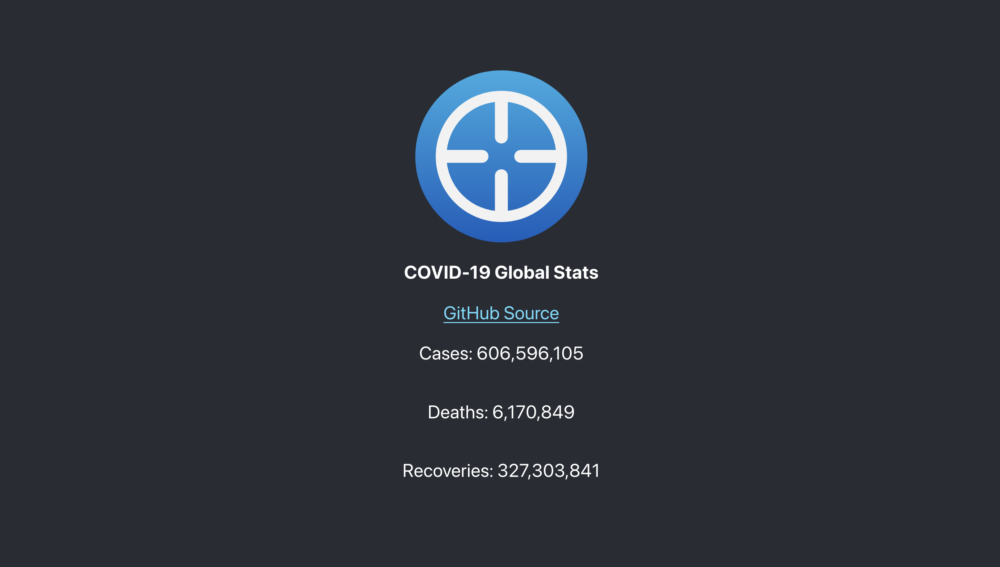

# Basic COVID-19 Tracker Dashboard

Somewhat of an extension of [Basic-COVID19-Tracker](https://github.com/KiyonoKara/Basic-COVID19-Tracker), this is a short and concise dashboard that displays the COVID-19 `cases`, `deaths`, and `recoveries`.

## Main Features
- See global cases, deaths, and recoveries on only one page.
- Simple design
- Disclaimer: The data is not completely accurate since it's purely calculated from adding all the stats from each entry from the API.

## Contributing
This project is no longer taking pull requests or issues.

## Usage
This dashboard is guaranteed to work on Node v12.3.1. If you wish to run this project, you should have your Node version at least at v12.3.1. Versions after v13.x.x seem to cause environment errors with the project. You can run this project on your localhost.

## Demonstration

## Acknowledgements
1. Reference to reported data: WHO COVID-19 Dashboard. Geneva: World Health Organization, 2020. Available online: https://covid19.who.int/ (2023/10/27).
2. API for estimated data: Google Covid-19 Open Data. https://health.google.com/covid-19/open-data/raw-data (2023/10/27)

## Project Status
Complete.

## License
[MIT](LICENSE.md)
