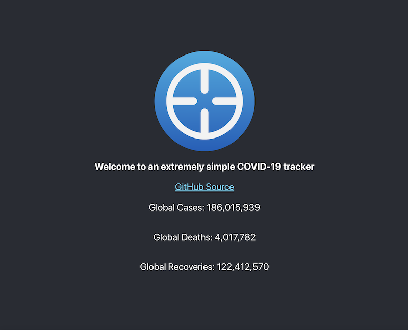

# Basic COVID-19 Tracker Dashboard

Somewhat of an extension of [Basic-COVID19-Tracker](https://github.com/KiyonoKara/Basic-COVID19-Tracker), this is a short and concise dashboard that displays the COVID-19 `cases`, `deaths`, and `recoveries`.

## Main Features
- See global cases, deaths, and recoveries on only one page.
- Simple design

## Contributing
This project is no longer taking 

## Usage
This dashboard is guaranteed to work on Node v12.3.1. If you wish to run this project, you should have your Node version at least at v12.3.1. Versions after v13.x.x seem to cause environment errors with the project. You can run this project on your localhost.

## Demonstration

## Project Status
Complete.

## License
[MIT](LICENSE.md)
